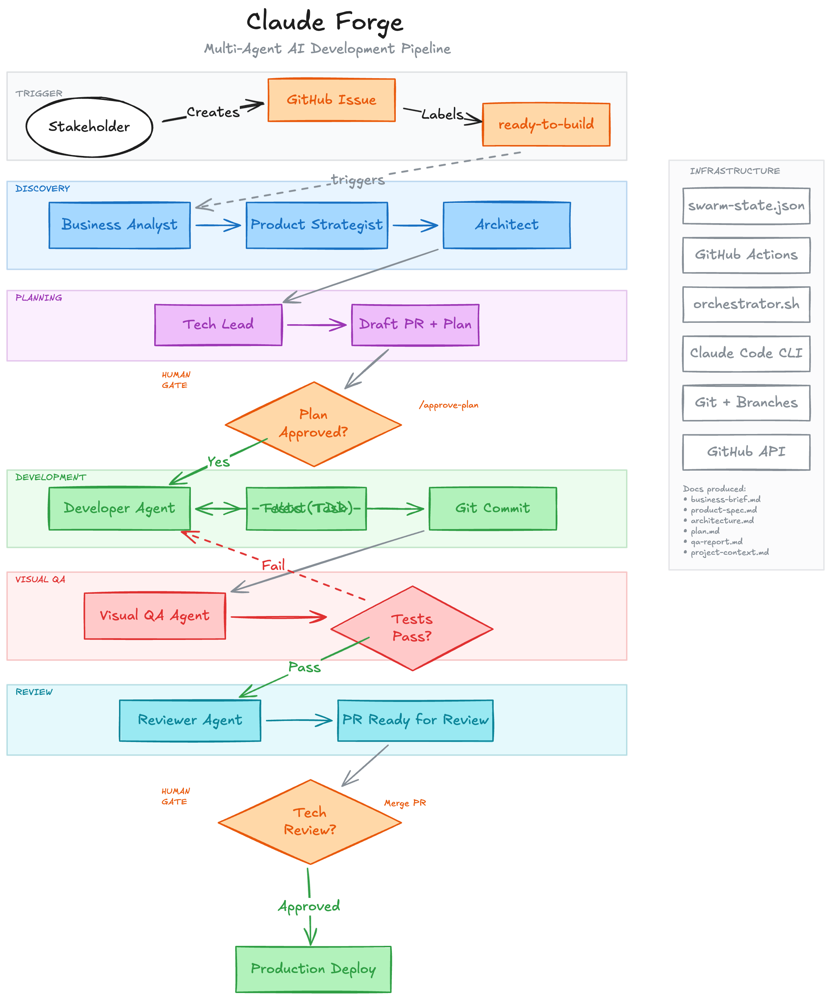

# Claude Forge

Multi-agent AI development pipeline. Stakeholders raise GitHub issues, an AI swarm plans and builds, PRs are created for review.



## How It Works

```
Stakeholder creates Issue (using template)
        |
Issue labeled "ready-to-build"
        |
GitHub Actions → Discovery workflow starts
        |
Discovery agents ask questions (issue comments)
        |
Stakeholder answers → feedback workflow resumes discovery
        |
Planning agent creates plan → Draft PR opened
        |
Stakeholder reviews plan, approves (/approve-plan)
        |
GitHub Actions → Build workflow starts
        |
Development agents build (TDD, visual QA loop)
        |
Reviewer agent checks quality → PR marked ready
        |
Tech reviewer merges → production
```

## Quick Start — New Project

### 1. Create repo from this template

```bash
gh repo create my-project --template jpgbarbosa/claudeforge --private
git clone git@github.com:<your-org>/my-project.git
```

### 2. Create infrastructure

- **Supabase**: Create project at [supabase.com](https://supabase.com), note the URL, anon key, and service role key
- **Vercel**: Import the GitHub repo at [vercel.com](https://vercel.com), link to the repo

### 3. Set GitHub secrets

Go to repo → Settings → Secrets and variables → Actions, and add:

| Secret | Source |
|---|---|
| `ANTHROPIC_API_KEY` | [Anthropic Console](https://console.anthropic.com/) |
| `SUPABASE_URL` | Supabase project settings → API |
| `SUPABASE_ANON_KEY` | Supabase project settings → API |
| `SUPABASE_SERVICE_ROLE_KEY` | Supabase project settings → API |

### 4. Fill in project context

Open `docs/project-context.md` and describe your project — the stack, folder structure, naming conventions, data model, and any patterns agents should follow. All agents read this file before doing any work.

### 5. Update config

Edit `.swarm/config.yaml`:
- `project_name` — your project name
- `repo` — e.g., `<your-org>/my-project`
- `stack` — adjust framework, runtime, etc.

### 6. Invite stakeholders

Share the repo with stakeholders. Point them to [docs/stakeholder-guide.md](docs/stakeholder-guide.md).

They create issues using the templates → the swarm handles the rest.

---

## Integrate into an Existing Project

If you already have a project with a GitHub repo, Supabase, and Vercel set up:

### 1. Clone the template

```bash
git clone git@github.com:jpgbarbosa/claudeforge.git /tmp/claudeforge
```

### 2. Run the integration script

```bash
cd /tmp/claudeforge
./scripts/integrate.sh /path/to/your-existing-project
```

This copies the swarm files (`.swarm/`, `scripts/`, `.github/`, `swarm-state.json`, docs) into your project without touching your existing code.

### 3. Fill in `docs/project-context.md`

**This is the most important step.** Describe your existing codebase — the stack, folder structure, naming conventions, data model, and patterns agents should follow.

### 4. Update `.swarm/config.yaml`

Set `project_name`, `repo`, and adjust the `stack` section to match your project.

### 5. Set GitHub secrets

Same as step 3 in the new project setup above.

### 6. Commit and push

```bash
cd /path/to/your-existing-project
git add -A
git commit -m "chore: integrate swarm agent pipeline"
git push
```

---

## File Structure

```
.swarm/
  config.yaml              # Project and agent configuration
  prompts/                 # Agent prompt files
    business-analyst.md
    product-strategist.md
    architect.md
    tech-lead.md
    developer.md
    visual-qa.md
    reviewer.md
  logs/                    # Agent execution logs (gitignored)

scripts/
  orchestrator.sh          # Main state machine executor
  github-integration.sh    # GitHub API helpers (gh CLI)
  integrate.sh             # Integration script for existing projects

docs/
  project-context.md       # Project knowledge base (read by all agents)
  stakeholder-guide.md     # Guide for non-technical stakeholders
  architecture.md          # Swarm and project architecture

.github/
  workflows/
    swarm-discovery.yaml   # Triggered by ready-to-build label
    swarm-build.yaml       # Triggered by plan approval
    swarm-feedback.yaml    # Triggered by stakeholder comments
  ISSUE_TEMPLATE/
    bug-report.yaml
    feature-request.yaml

swarm-state.json           # Pipeline state (current stage, tasks, etc.)
vercel.json                # Vercel configuration
```

## Agent Roles

| Stage | Agent | Responsibility |
|---|---|---|
| Discovery | Business Analyst | Clarifies business goals, asks stakeholder questions |
| Discovery | Product Strategist | Creates user stories and acceptance criteria |
| Discovery | Architect | Designs data model, API surface, component structure |
| Planning | Tech Lead | Breaks spec into ordered, testable tasks |
| Development | Developer | Implements tasks using TDD |
| Visual QA | QA Agent | Tests the running app in a browser |
| Review | Reviewer | Checks code quality, security, documentation, updates project context |

## GitHub Actions Workflows

| Workflow | Trigger | What it does |
|---|---|---|
| `swarm-discovery` | Issue labeled `ready-to-build`, or `workflow_dispatch` | Runs discovery agents, opens draft PR |
| `swarm-build` | PR approved or `/approve-plan` comment | Runs dev loop, visual QA, reviewer, marks PR ready |
| `swarm-feedback` | Comment on issue with `swarm-working` label | Clears human-input flag, re-triggers discovery |

## Configuration

Edit `.swarm/config.yaml` to configure:

- **project_name** / **repo** — identifies the project
- **model** — which Claude model agents use
- **stages** — pipeline stages (discovery → planning → development → visual_qa → review)
- **github** — label names, PR settings
- **gates** — human approval checkpoints (plan approval, tech review)
- **stack** — framework, runtime, database, testing tools

## Architecture

See [docs/architecture.md](docs/architecture.md) for the full swarm architecture, agent roles, state machine design, and event-driven workflow model.
